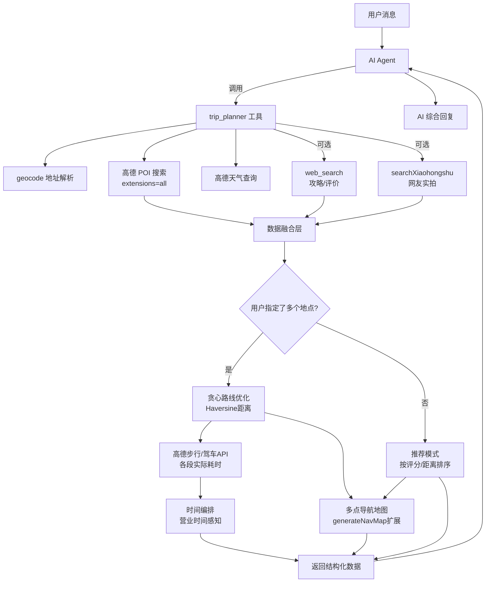

# DESIGN — 当地行程规划

## 整体架构



## 核心组件设计

### 1. trip_planner 工具入口

**两种运行模式：**

- **推荐模式**：用户只给了当前位置，无 `places` 参数 → 搜索周边 POI + 推荐排序
- **规划模式**：用户给了多个地点（`places`）→ 路线优化 + 时间编排 + 导航地图

```
输入参数:
  location: string       // 必填，当前位置
  city?: string          // 城市，默认从 location 推断
  interests?: string     // 兴趣偏好关键词
  places?: string[]      // 要去的地点列表
  duration?: string      // 可用时间
  transport?: string     // 交通方式偏好
```

### 2. POI 搜索与增强

```
步骤:
1. geocode(location) → 获取当前位置坐标
2. 高德 /v3/place/around (extensions=all) → 搜索周边POI
   - types 参数按 interests 映射：
     "景点/风景" → "110000" (风景名胜)
     "美食/吃" → "050000" (餐饮服务)
     "购物" → "060000" (购物服务)
     "娱乐/玩" → "080000" (休闲娱乐)
     未指定 → 同时搜景点+美食
   - radius: 3000m（默认）
   - extensions: all（获取评分、营业时间等）
3. 对结果按评分排序，取 Top N
```

### 3. 贪心路线优化

```typescript
function optimizeRoute(
  start: { lng: number; lat: number },
  points: Array<{ name: string; lng: number; lat: number }>,
): Array<{ name: string; lng: number; lat: number; order: number }>;

// 算法：
// 1. current = start
// 2. 从剩余点中选 Haversine 距离最近的点
// 3. 移动到该点，标记已访问
// 4. 重复直到所有点访问完毕

// Haversine 公式：
function haversineDistance(lat1: number, lng1: number, lat2: number, lng2: number): number; // 返回米
```

### 4. 时间编排

```
输入：优化后的点序列 + 各段步行/驾车耗时
输出：每个点的预计到达时间、建议停留时间、到下一点的耗时

规则：
- 景点默认停留 60min，美食 45min，购物 30min
- 考虑营业时间：如果某点即将关门，调整顺序或标注提醒
- 考虑用餐时间：11:30-13:00 和 17:30-19:00 优先安排美食
- 如果总时间超过 duration，标注"时间可能不够，建议精简"
```

### 5. 多点导航地图

```
扩展现有 generateNavMap()：
- 支持标注多个点（不只是起终点）
- 每个点用不同颜色/编号标注
- 用虚线连接各点表示游览顺序
- 高德静态地图 API markers 参数支持多标记
```

## 接口契约

### 输入

```typescript
const TripPlannerSchema = Type.Object({
  location: Type.String({
    description: "当前所在位置，如 '西湖' '春熙路' '南京路步行街'",
  }),
  city: Type.Optional(
    Type.String({
      description: "城市名，如 '杭州'、'成都'",
    }),
  ),
  interests: Type.Optional(
    Type.String({
      description: "兴趣偏好，如 '美食' '历史文化' '自然风景' '购物'",
    }),
  ),
  places: Type.Optional(
    Type.Array(Type.String(), {
      description: "想去的地点列表，如 ['灵隐寺', '河坊街', '南宋御街']",
    }),
  ),
  duration: Type.Optional(
    Type.String({
      description: "可用时间，如 '半天' '3小时' '一整天'",
    }),
  ),
  transport: Type.Optional(
    Type.String({
      description: "交通方式偏好：'步行'（默认）、'驾车'、'公交'",
    }),
  ),
});
```

### 输出

```typescript
interface TripPlannerResult {
  location: string;
  city: string;
  weather?: { condition: string; temperature: string; wind: string; is_rainy: boolean };

  // 推荐模式返回
  recommendations?: Array<{
    name: string;
    type: string; // "景点" | "美食" | "购物" | "娱乐"
    rating?: string; // 高德评分
    distance: string; // 距当前位置
    address: string;
    business_hours?: string;
    tel?: string;
  }>;

  // 规划模式返回
  itinerary?: Array<{
    order: number;
    name: string;
    address: string;
    arrive_time?: string; // 预计到达
    suggested_stay: string; // 建议停留
    to_next?: string; // 到下一点的距离和耗时
  }>;
  total_distance?: string;
  total_duration?: string;

  // 通用
  web_tips?: string; // web_search 攻略摘要
  xiaohongshu_tips?: string;
  image_path?: string; // 导航地图
  map_description?: string;
}
```

## 异常处理策略

- 高德 API Key 未配置 → 返回错误提示
- geocode 解析失败 → 返回"无法识别位置"
- POI 搜索无结果 → 降级到 web_search 搜索推荐
- 小红书 MCP 不可用 → 跳过，不影响主流程
- web_search 不可用 → 跳过，不影响主流程
- places 中某个地点无法解析 → 跳过该点，在结果中标注

## 文件变更清单

1. `src/agents/tools/amap-tool.ts` — 新增 `createTripPlannerTool()` 及辅助函数
2. `src/agents/openclaw-tools.ts` — 注册 trip_planner 工具
3. `src/agents/pi-embedded-subscribe.tools.ts` — 添加到媒体信任列表
4. `src/agents/system-prompt.ts` — 更新 Travel Assistance 章节
