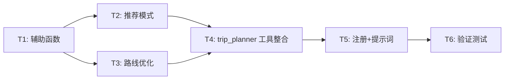

# TASK — 当地行程规划

## 任务依赖图

## T1: 辅助函数开发

**输入**：现有 `amap-tool.ts` 中的 `geocode()`、`amapGet()` 等函数
**输出**：新增 `haversineDistance()`、`optimizeRouteGreedy()`、`parseDuration()`、`generateMultiPointMap()`
**实现约束**：放在 `amap-tool.ts` 中，紧接现有辅助函数后面
**验收标准**：

- `haversineDistance()` 正确计算两点球面距离
- `optimizeRouteGreedy()` 对 N 个点返回贪心最近顺序
- `parseDuration()` 解析"半天"→4h、"3小时"→3h、"一整天"→8h
- `generateMultiPointMap()` 生成多标记点的静态地图

## T2: 推荐模式实现

**输入**：T1 的辅助函数 + 高德 POI API
**输出**：`fetchRecommendations()` 函数
**实现约束**：

- 调用高德 `/v3/place/around` 带 `extensions=all`
- interests 映射到高德 types 编码
- 按评分排序，取 Top 8
- 返回 `recommendations` 数组
  **验收标准**：
- 输入"西湖, 美食" → 返回西湖附近评分最高的餐厅列表
- 每条包含 name, type, rating, distance, address, business_hours

## T3: 路线优化+时间编排实现

**输入**：T1 的辅助函数 + 高德步行/驾车 API
**输出**：`planItinerary()` 函数
**实现约束**：

- 先用 geocode 解析所有地点坐标
- 用贪心算法优化顺序
- 调用步行/驾车 API 获取各段实际耗时
- 根据 POI 类型分配停留时间
- 考虑当前时间 + duration 约束
  **验收标准**：
- 输入 3 个地点 → 返回最优顺序 + 每段耗时 + 总距离
- itinerary 每条包含 order, name, arrive_time, suggested_stay, to_next

## T4: trip_planner 工具整合

**输入**：T2 的 `fetchRecommendations()` + T3 的 `planItinerary()`
**输出**：`createTripPlannerTool()` 导出函数
**实现约束**：

- 遵循 `AnyAgentTool` 接口
- TypeBox Schema 参数定义
- 两种模式分支：无 places → 推荐模式，有 places → 规划模式
- 并行获取天气 + 小红书 + 主数据
- 生成导航地图
  **验收标准**：
- 工具能被正常创建和调用
- 推荐模式和规划模式都能返回正确结构

## T5: 注册 + 系统提示词更新

**输入**：T4 的 `createTripPlannerTool()`
**输出**：工具可被 AI Agent 调用
**实现约束**：

- `openclaw-tools.ts` 添加 `createTripPlannerTool()` 调用
- `pi-embedded-subscribe.tools.ts` 添加 `trip_planner` 到信任列表
- `system-prompt.ts` 更新 Travel Assistance 章节，添加 trip_planner 工具说明和使用指导
  **验收标准**：
- 工具出现在 AI 可用工具列表中
- 系统提示词正确指导 AI 何时调用此工具

## T6: 功能验证

**输入**：完成的 trip_planner 工具
**输出**：类型检查通过 + 基本功能验证
**验收标准**：

- `pnpm tsgo` 无类型错误
- 工具定义正确（参数、描述、执行函数）
